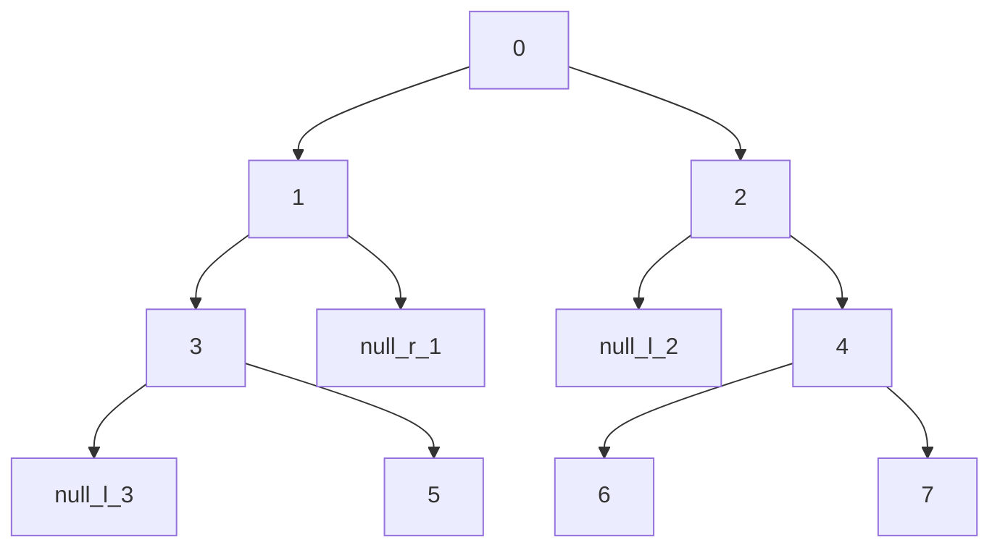
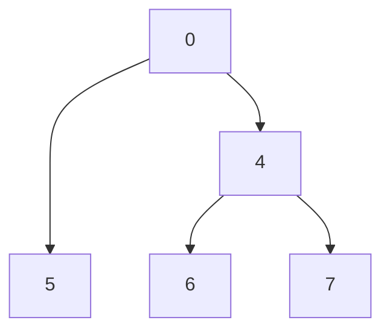

# Daily Coding Problem #254 [Medium]

Problem asked by Yahoo.

## Problem Statement

Recall that a full binary tree is one in which each node is either a leaf node,
or has two children. Given a binary tree, convert it to a full one by removing nodes with only one child.

For example, given the following tree:

You should convert it to:

